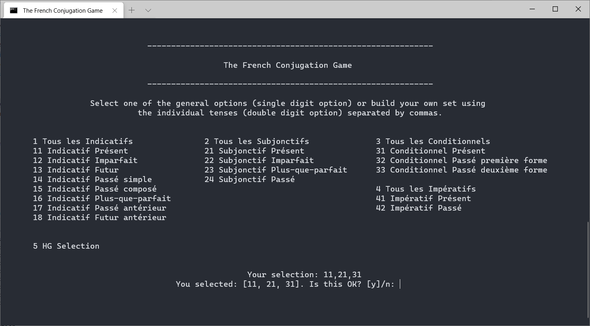
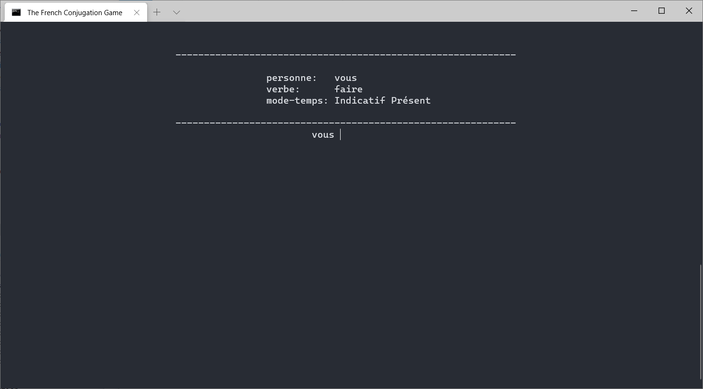
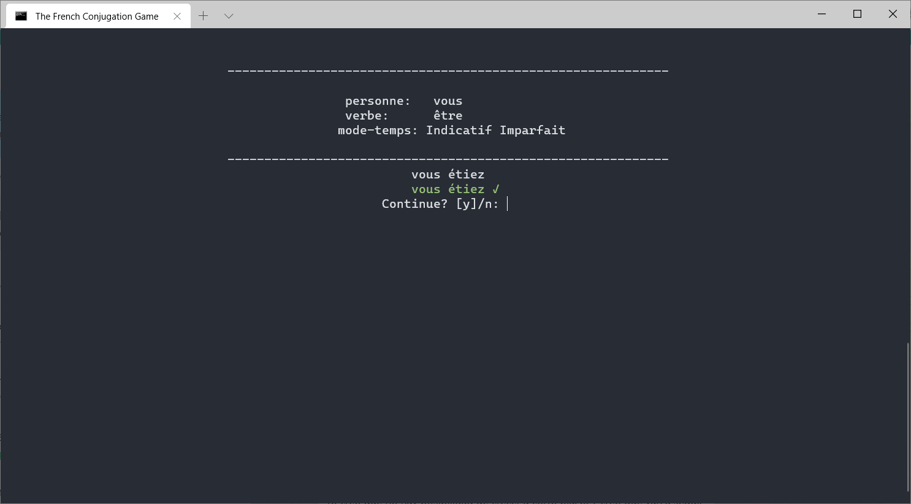
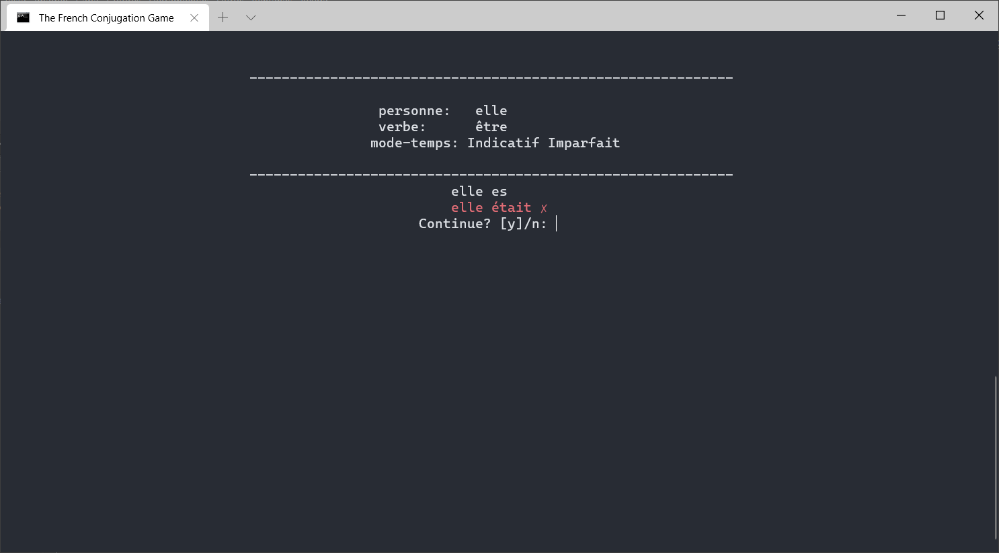
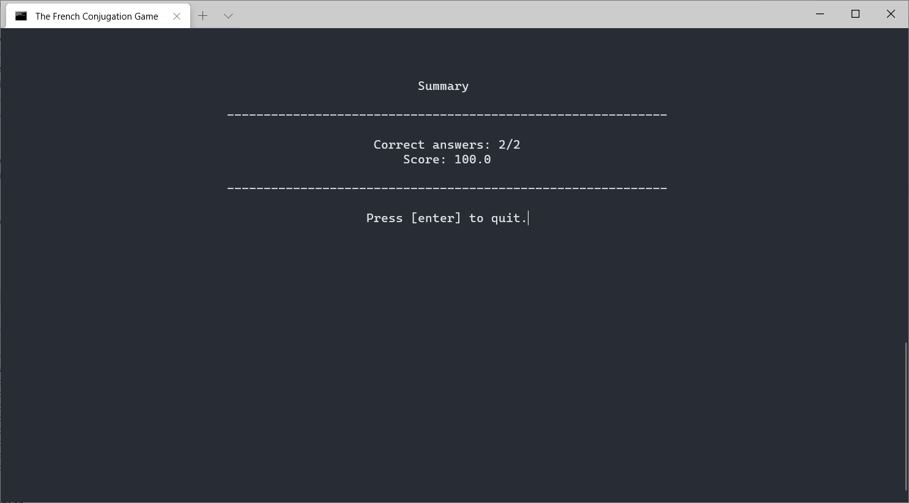

# The French Conjugation Game

A small console application written in Python to practice the conjugation of verbs in French. 


## Requirements
 - Python 3.7+
 - colorama: Python package to add color to the console text and move the cursor. Makes it easier to work on different platforms. Expecting to remove this dependency in future versions.

## Setup
### Script
**NOTE:** This assumes that Python is added to your PATH variable.

1. In your OS explorer, go to the location where you downloaded the project
    2. **Windows:** Double-click on the file **run.bat**
    3. **Mac:** Double-click on the file **run.sh**
    
### Manually
1. Download de code
2. Open a terminal
    1. Windows: Press the \[Windows\] key and then type *cmd* and press the enter key.
    2. Mac: Press \[command\] + \[space\]. Then type *terminal* and press the enter key.
3. On the terminal, move to the where you downloaded the project:
    1.
4. Type and execute the following:
    ```
    python main.py
    ```

## Playing the game
### Configuring your dictionaries

### The game

1. The first screen asks you to select the tense or group of tenses to practice the verbs
   1. Enter one of the options with a single digit or enter a set of double digit options separated by commas
   2. Confirm your choice by pressing \[enter\], or type *n* and press \[enter\] to cancel your selection
   
   
   <!--
   
   -->
   

2. The next screen asks you to enter the correct conjugation of the verb in the given tense for the given person.

   
   
   1. Enter your answer and hit \[enter\]. If your verb is correctly conjugated, you'll see the verb in green, otherwise, the correct verb will appear in red.
      - Correct answer:
         
      - Incorrect answer
         

3. After answering the question, press \[enter\] to continue to the next question or type \[n\] to finish the game.
   - Another way to end the game is by typing *exit* when the conjugated verb is requested and then press \[enter\].
   
4. If you answer incorrectly 4 times, the game will end.

5. Finally, at the Summary screen, you can see you're score given the number of correct answers out of the total questions.
   
   